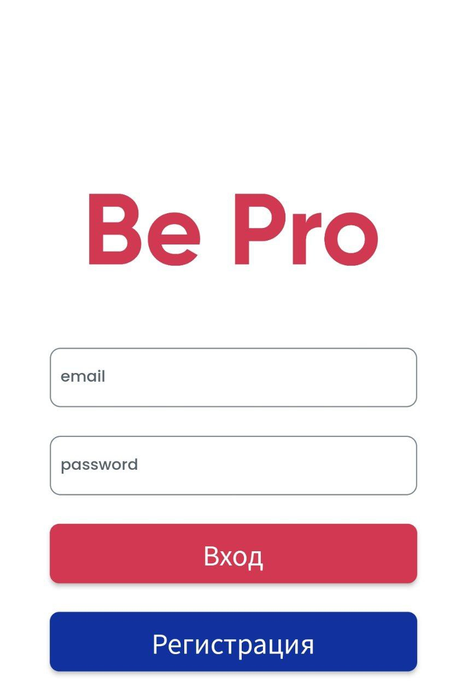

# BePro
Server part of the bePro mobile application

## Examples of parts of the front end that are connected to the database

### 1. Registration and authorization

 

### 2. Team's information 
Showing current information about the team.

### 3. Player's statistic
Statistics output with the possibility of user editing.

### 4. Change of personal data

